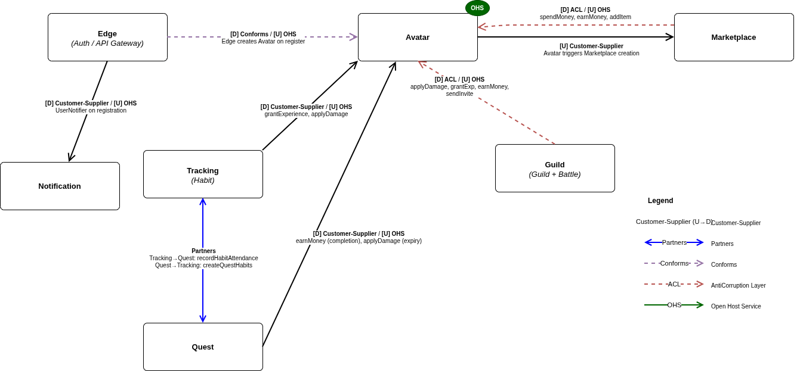

# Context Map
**Avatar** is the central bounded context and acts as an upstream for most of the system.  
It exposes a stable REST API that all other contexts consume, so it's considered an **Open Host Service (OHS)**.

The mapped relationships are:

- **Edge → Avatar** — Conformist [D] / OHS [U]:  
  During registration, `AuthController` directly calls `AvatarClient` using Avatar’s user ID without translation. Edge adapts to Avatar’s model.

- **Edge → Notification** — Customer-Supplier:  
  `AuthServiceImpl` uses `UserNotifier` to send registration notifications. This is a unidirectional relationship where Notification is a stable supplier.

- **Avatar → Marketplace** — Customer-Supplier [U→D]:  
  `AvatarCommandServiceImpl` calls `MarketplaceClientPort.createMarketplace` during avatar creation. Avatar drives the Marketplace lifecycle.

- **Marketplace → Avatar** — Anti-Corruption Layer (ACL) [D] / OHS [U]:  
  `MarketplaceCommandServiceImpl` translates its internal concepts of Money and Item into Avatar REST calls via the port interface (`AvatarClientPort`). The port acts as an anti-corruption layer isolating the internal model.

- **Guild → Avatar** — Anti-Corruption Layer (ACL) [D] / OHS [U]:  
  Both `BattleCommandServiceImpl` and `GuildCommandServiceImpl` translate battle/guild concepts (damage, rewards, invitations) into calls to the Avatar model via `AvatarClientPort`.

- **Tracking → Avatar** — Customer-Supplier [D] / OHS [U]:  
  `HabitCommandServiceImpl` calls `grantExperience` and `applyDamage` on Avatar. No significant translation, just a simple downstream dependency.

- **Tracking ⟷ Quest** — Partners:  
  Coordinated bidirectional integration.  
  Tracking calls `QuestClientPort.recordHabitAttendance` when a habit is completed;  
  Quest calls `TrackingHabitsClientPort.createQuestHabitsForAvatar` when an avatar joins a quest.

- **Quest → Avatar** — Customer-Supplier [D] / OHS [U]:  
  `QuestCommandServiceImpl` calls `earnMoney` on completion, while `QuestQueryServiceImpl` calls `applyDamage` when a quest expires.

