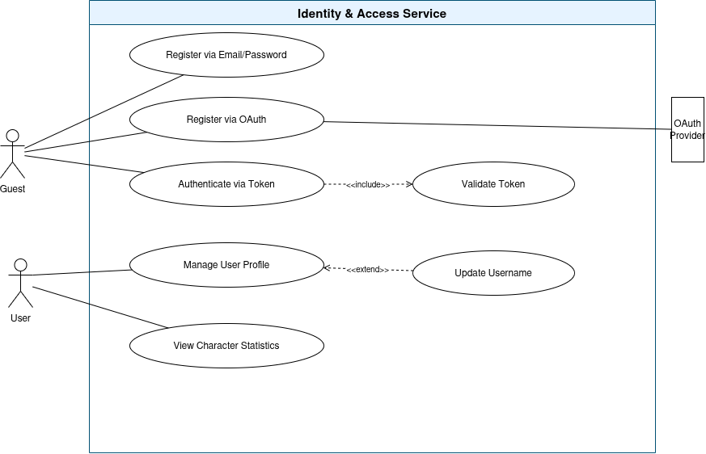
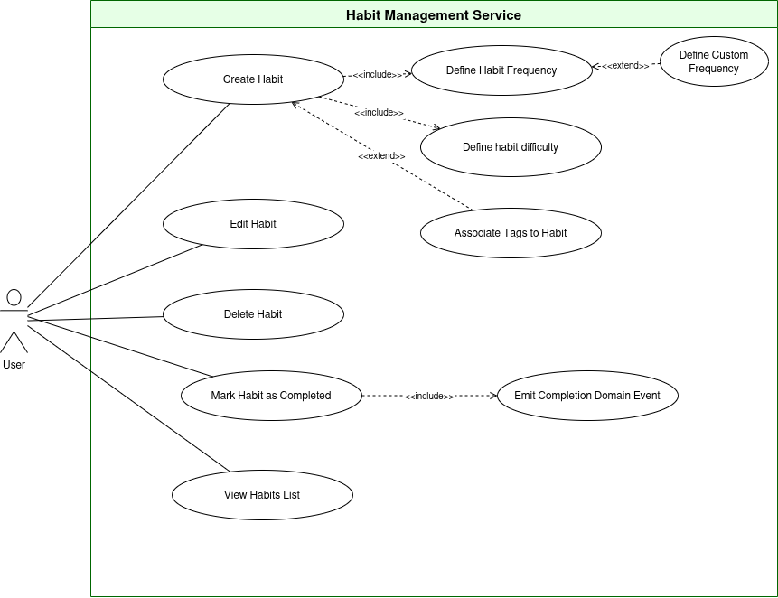
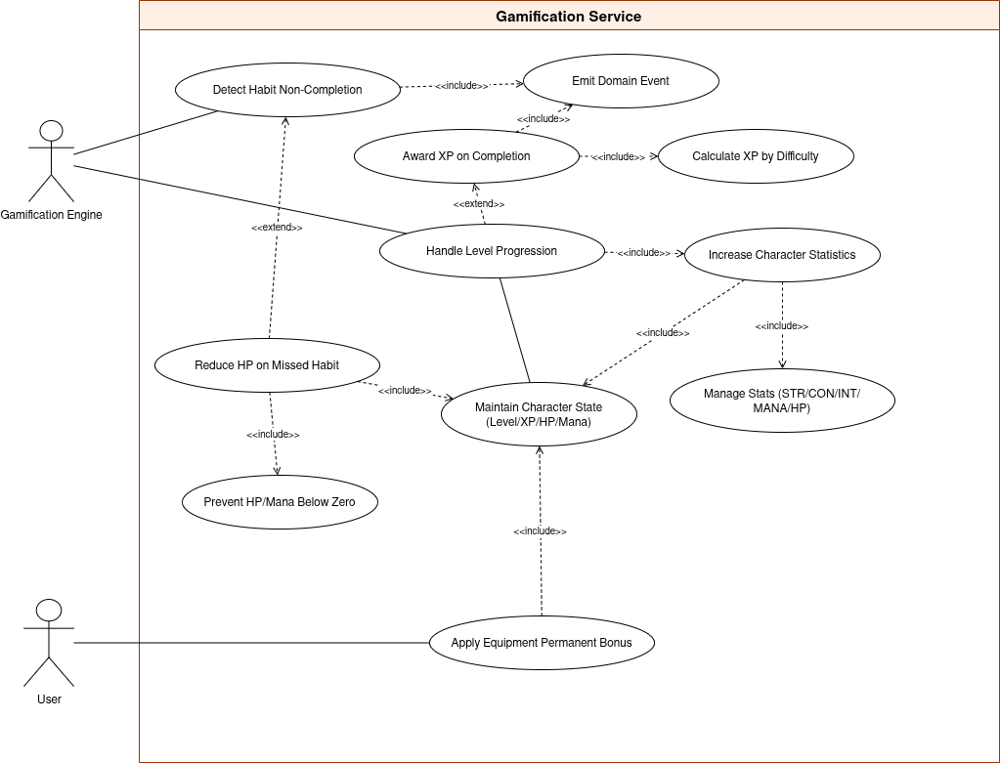
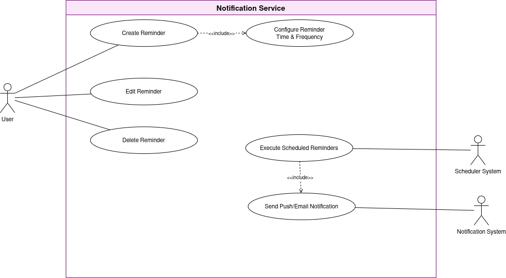
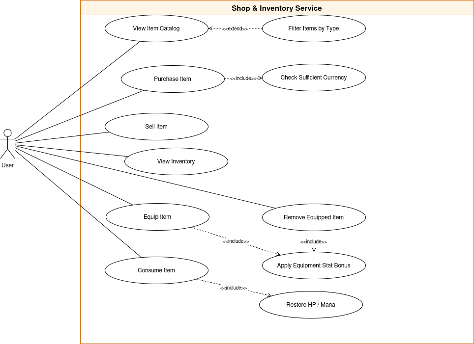
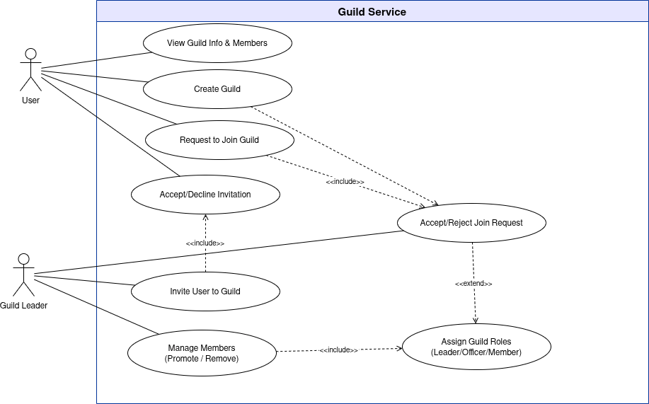
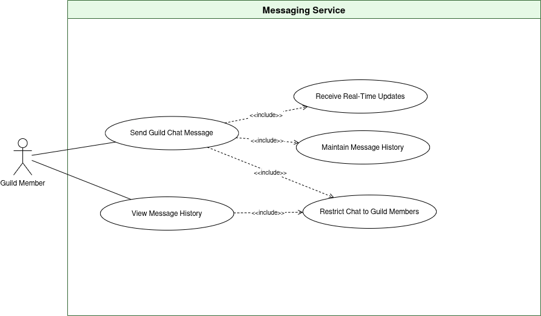
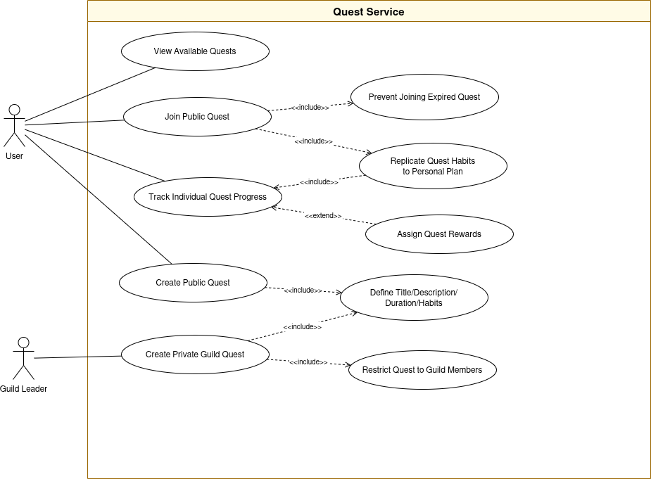
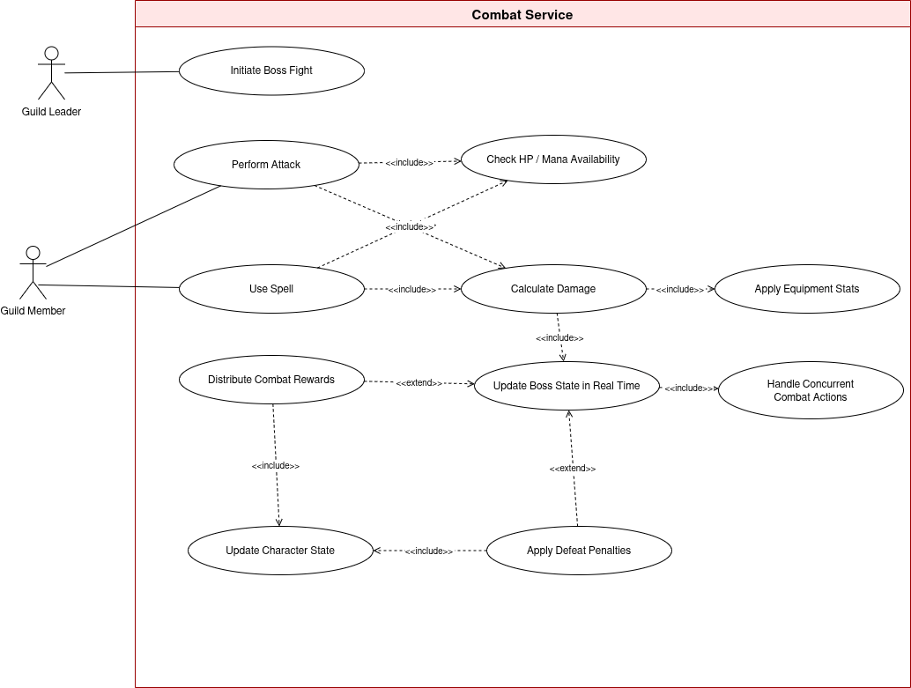

# Use cases for Habit RPG Microservices
## Identity and Access Service

## Habit Management Service

## Gamification Service

## Notification Service

## Shop and Inventory Service

## Guild Service

## Messaging Service

## Quest Service

## Combat Service
